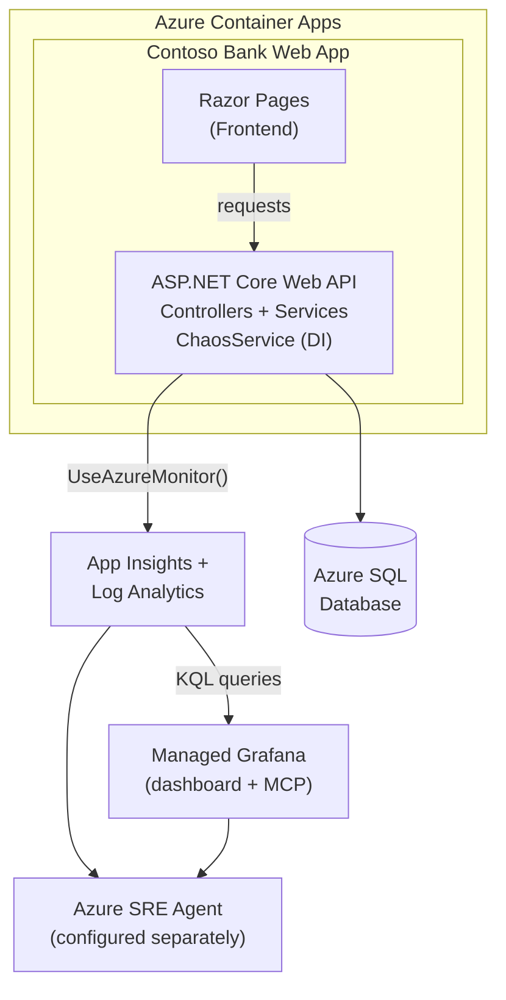
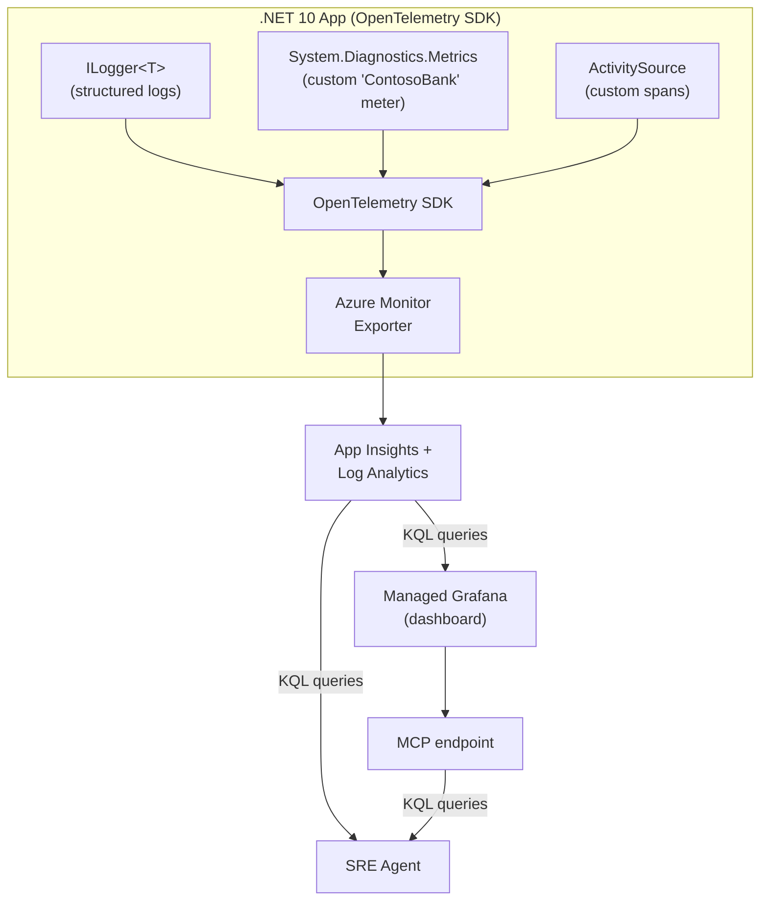

# Contoso Bank — Azure SRE Agent Demo

A demo banking application for [Azure SRE Agent](https://learn.microsoft.com/en-us/azure/sre-agent/overview). Failure scenarios are embedded into normal banking workflows — clicking buttons like "Generate Annual Statement" or "Run Fraud Detection" silently triggers realistic production issues (memory leaks, CPU spikes, HTTP 500s, etc.) that SRE Agent can detect, investigate, and mitigate.

## Table of Contents

- [Architecture](#architecture)
- [Prerequisites](#prerequisites)
- [Quick Start](#quick-start)
- [Chaos Scenarios](#chaos-scenarios)
- [Azure SRE Agent Setup](#azure-sre-agent-setup)
- [Project Structure](#project-structure)
- [Running Tests](#running-tests)
- [Cleanup](#cleanup)
- [License](#license)


## Architecture



### Tech Stack

| Layer | Technology | Azure Service |
|-------|-----------|---------------|
| Frontend | ASP.NET Core Razor Pages | — |
| Backend | ASP.NET Core Web API (C# / .NET 10) | Azure Container Apps |
| Database | Entity Framework Core | Azure SQL Database |
| Observability | OpenTelemetry SDK (logs, metrics, traces) | App Insights + Log Analytics |
| Dashboards | Azure Managed Grafana (KQL) | Grafana + MCP endpoint |
| IaC | Bicep + Azure Developer CLI (`azd`) | One-command deployment |

### Deployed Resources

| Resource | Bicep Module | Purpose |
|----------|-------------|---------|
| Resource Group | `main.bicep` | Contains all resources |
| Container Apps Environment + ACR | `modules/container-env.bicep` | App hosting + image registry |
| Container App | `modules/container-app.bicep` | The Contoso Bank app |
| Azure SQL Server + DB | `modules/sql.bicep` | Application database (AAD-only auth) |
| Application Insights + Log Analytics | `modules/monitoring.bicep` | APM, telemetry, log aggregation |
| Azure Monitor Workspace | `modules/monitor-workspace.bicep` | Metrics backend for Grafana |
| Azure Managed Grafana | `modules/grafana.bicep` | Dashboards (KQL) + MCP endpoint for SRE Agent |
| Alert Rules + Action Group | `modules/alerts.bicep` | 10 pre-configured alerts mapped to chaos scenarios |
| Managed Identity | `modules/identity.bicep` | RBAC for app, monitoring, and Grafana |

## Prerequisites

- [Azure Developer CLI (`azd`)](https://learn.microsoft.com/en-us/azure/developer/azure-developer-cli/install-azd) v1.9+
- [Azure CLI (`az`)](https://learn.microsoft.com/en-us/cli/azure/install-azure-cli) v2.60+
- [.NET 10 SDK](https://dotnet.microsoft.com/download/dotnet/10.0)
- [Docker Desktop](https://www.docker.com/products/docker-desktop/) (for local container builds)
- An Azure subscription with permissions to create resources (Contributor + User Access Administrator)

## Quick Start

### One-Command Deployment

```bash
# Clone the repo
git clone https://github.com/<org>/sre-agent-demo.git
cd sre-agent-demo

# Deploy everything (infra + app + monitoring + dashboards)
azd up
```

`azd up` provisions all Azure resources, builds and deploys the container, and runs the post-provision script which:

1. Grants managed identity access to SQL Database
2. Seeds the database with demo banking data
3. Configures Container Apps OpenTelemetry agent
4. Sets up Grafana data sources (Azure Monitor, Log Analytics)
5. Imports the Grafana dashboard
6. Outputs the Grafana MCP endpoint URL and SRE Agent setup instructions

### Local Development

```bash
# Build and run locally (uses EF Core InMemory database)
cd src/ContosoBank
dotnet run

# Or run with Docker
docker build -t contoso-bank .
docker run -p 8080:8080 contoso-bank
```

The app is available at `http://localhost:8080` with these endpoints:

| Endpoint | Purpose |
|----------|---------|
| `/` | Banking dashboard (home page) |
| `/health/live` | Liveness probe (always 200) |
| `/health/ready` | Readiness probe (checks DB connectivity) |

### Local Grafana

The `grafana/` directory contains a Docker Compose setup that runs Grafana locally, connected directly to your Azure Monitor / Log Analytics workspace via managed identity — no Prometheus needed.

```bash
cd grafana
docker compose up -d
# Grafana is available at http://localhost:3000 (admin/admin)
```

The local Grafana instance is pre-provisioned with:
- **Azure Monitor datasource** — authenticates via managed identity (`azureAuthType: msi`)
- **Contoso Bank dashboard** — the same KQL-based dashboard deployed to Azure Managed Grafana

## Chaos Scenarios

The demo includes **8 distinct failure scenarios**, each triggered by a natural-looking banking action. Every scenario auto-recovers after 5 minutes so the demo can be repeated without manual cleanup.

| # | Scenario | Page → Button | What Breaks |
|---|----------|--------------|-------------|
| 1 | **Memory Leak** | Reports → "Generate Annual Statement" | Allocates large byte arrays, causes OOM kill |
| 2 | **CPU Spike** | Dashboard → "Run Fraud Detection" | CPU-intensive hash computation, pins all cores |
| 3 | **HTTP 500 Errors** | Transfers → "Wire Transfer" | `InvalidOperationException` on every request |
| 4 | **DB Connection Failure** | Accounts → "Refresh" | `DbConnectionInterceptor` blocks all DB queries |
| 5 | **Slow API (30s)** | Transfers → "International Transfer" | `Task.Delay(30s)` in transfer pipeline |
| 6 | **Dependency Timeout** | Settings → "Verify Identity (KYC)" | HTTP call to non-routable IP, thread pool exhaustion |
| 7 | **Log Flooding** | Transactions → "Export Full History" | Thousands of verbose log entries per second |
| 8 | **Exception Storm** | Reports → "Run Batch Reconciliation" | Parallel tasks throwing diverse exception types |

> 📋 See [DEMO.md](DEMO.md) for a detailed demo walkthrough with suggested flow and best starting scenarios.

### Observability Signals

Each chaos scenario produces distinct telemetry that SRE Agent can investigate:



## Azure SRE Agent Setup

### Grafana MCP Connector

Every Azure Managed Grafana instance exposes a built-in MCP endpoint at `/api/azure-mcp` ([docs](https://github.com/Azure/azure-managed-grafana/blob/main/amg-mcp.md)). After `azd up`, find your endpoint:

```bash
# Get the Grafana MCP endpoint from azd environment
azd env get-value GRAFANA_MCP_ENDPOINT
# Example: https://graf-<name>.cse.grafana.azure.com/api/azure-mcp
```

#### Authentication: Grafana Service Account Token (Recommended)

Use a Grafana service account token for a **one-time setup** that doesn't expire:

1. Open your Grafana instance (get the URL with `azd env get-value GRAFANA_ENDPOINT`)
2. Navigate to **Administration → Service accounts**
3. Create a new service account with **Viewer** role
4. Click **Add token** → generate a token (format: `glsa_xxx`)
5. Copy the token — you'll use it in the connector config below

> **Alternative:** Use an Entra ID token for short-lived access (expires in ~1 hour):
> ```bash
> az account get-access-token --resource ce34e7e5-485f-4d76-964f-b3d2b16d1e4f --query accessToken -o tsv
> ```

#### Connect SRE Agent

1. Go to [sre.azure.com](https://sre.azure.com) → **Builder** → **Connectors**
2. Click **+ Add connector** → **MCP Server**
3. Enter the MCP URL from `azd env get-value GRAFANA_MCP_ENDPOINT`
4. Auth: **Bearer token** — paste the Grafana service account token (`glsa_xxx`)
5. Select tools → **Select all**
6. Save — status should show **Connected**

Through this MCP endpoint, SRE Agent gets access to tools like `amgmcp_query_resource_log`, `amgmcp_insights_get_failures`, `amgmcp_prometheus_query`, and more — enabling it to query App Insights, Log Analytics, and Azure Monitor metrics directly via Grafana.

### Investigation Workflows

Once connected, SRE Agent (and any engineer using Grafana) can investigate each scenario by following the telemetry trail. Every chaos action emits a distinctive combination of an Azure Monitor alert (`A1`–`A10`), a custom metric, and structured logs. The activation/recovery of each scenario is also logged via `ChaosScenario activated` / `ChaosScenario recovered` warnings, which act as ground-truth markers when correlating signals.

| Scenario | Alert(s) | Primary Signal | Distinguishing Clue |
|----------|----------|----------------|---------------------|
| Memory Leak | A1 (High Memory), A2 (OOM Restart) | `dotnet.process.memory.working_set` climbs steadily | Memory grows without leveling off; ends in container restart |
| CPU Spike | A3 (High CPU) | `process.cpu.time` pinned > 95% | CPU saturated while memory stays flat |
| HTTP 500 Errors | A4 (HTTP 5xx) | 5xx rate on `/api/transfers/wire` | `InvalidOperationException` traces on a single endpoint |
| DB Connection Failure | A5 (DB Failures), A10 (Health Degraded) | `contosobank.db.errors` spike | `/health/ready` flips to unhealthy; DB query errors flood |
| Slow API (30s) | A6 (P95 Latency) | P95/P99 latency spike on `/api/transfers/international` | Latency high but CPU **and** memory normal → external dependency |
| Dependency Timeout | A7 (Dependency Timeout) | `contosobank.dependency.timeouts` spike | Timeout exceptions tagged `dependency=kyc_provider` |
| Log Flooding | A8 (Log Volume) | `contosobank.log.entries` rockets (~1000/s) | Sudden flood of `Debug`-level `Transaction batch item` logs |
| Exception Storm | A9 (Exception Storm) | `contosobank.exceptions` spike (~20/s) | **Multiple** exception types appear together (Null/Argument/DivideByZero/Format) |

**Suggested investigation steps for SRE Agent:**

1. **Start from the alert.** The firing alert (`A1`–`A10`) narrows the problem class immediately. Use the [Alert-to-Scenario Mapping](DEMO.md#alert-to-scenario-mapping) to identify the likely trigger.
2. **Confirm with metrics.** Query the custom `ContosoBank` meter (e.g. `contosobank.exceptions`, `contosobank.db.errors`) or platform metrics (`process.cpu.time`, `dotnet.process.memory.working_set`) to confirm the signature.
3. **Correlate logs.** Search Log Analytics for the matching exception type or the `ChaosScenario activated` warning to pinpoint the start time and affected component.
4. **Differentiate look-alikes.** Slow API vs. CPU/Memory issues all surface as a degraded user experience — the distinguishing factor is *which* resource is saturated (see the "Distinguishing Clue" column above).

Example KQL to find the exact moment a scenario was triggered:

```kusto
AppTraces
| where Message startswith "ChaosScenario activated"
| project TimeGenerated, Message
| order by TimeGenerated desc
```

### Mitigation Playbooks

Every chaos scenario in this demo is **self-healing**: it activates a `CancellationTokenSource` with a 5-minute timeout (`DefaultDuration`), after which the scenario automatically deactivates and logs `ChaosScenario recovered`. This makes the demo safe to repeat without manual cleanup, and lets SRE Agent observe a full detect → investigate → resolve lifecycle.

| Scenario | Auto-Recovery Behavior | Manual Mitigation |
|----------|------------------------|-------------------|
| Memory Leak | Held byte arrays are released after 5 min, **but GC may not reclaim them until the process restarts** | Restart the container revision (see below) |
| CPU Spike | CPU loops stop after 5 min | None required |
| HTTP 500 Errors | Error injection stops after 5 min | None required |
| DB Connection Failure | DB interceptor stops blocking after 5 min; `/health/ready` recovers | None required |
| Slow API | Latency injection stops after 5 min | None required |
| Dependency Timeout | Timeout injection stops after 5 min | None required |
| Log Flooding | Log generation stops after 5 min | None required |
| Exception Storm | Exception loop stops after 5 min | None required |

**Guaranteed clean reset.** Because a memory leak can persist until the process restarts, restart the Container App revision to force a fully clean state:

```bash
APP=$(az containerapp list -g rg-sre-agent-demo-2 --query "[0].name" -o tsv)
az containerapp revision restart -g rg-sre-agent-demo-2 -n $APP \
  --revision $(az containerapp revision list -g rg-sre-agent-demo-2 -n $APP --query "[?properties.active].name | [0]" -o tsv)
```

> 💡 In a real incident, SRE Agent would propose a mitigation (e.g. scale out, restart the revision, roll back a deployment) and ask for approval before acting. This demo's auto-recovery simulates the "resolved" state so you can showcase the full agent workflow end-to-end. See [DEMO.md](DEMO.md#resetting-the-app-after-a-demo) for the full reset procedure.

## Project Structure

```
├── azure.yaml                    # azd project manifest
├── DEMO.md                       # Demo cheat sheet & walkthrough
├── ContosoBank.slnx              # Solution file
├── grafana/
│   ├── docker-compose.yml        # Local Grafana (Azure Monitor via managed identity)
│   ├── dashboards/
│   │   └── contoso-bank.json     # Grafana dashboard (KQL panels)
│   └── provisioning/
│       ├── dashboards/
│       │   └── default.yaml      # Dashboard provisioning config
│       └── datasources/
│           └── azure-monitor.yaml # Azure Monitor datasource (MSI auth)
├── infra/
│   ├── main.bicep                # Main orchestration (subscription-scoped)
│   ├── main.bicepparam           # Parameter defaults
│   └── modules/                  # 8 Bicep modules (see Deployed Resources)
├── scripts/
│   ├── post-provision.sh         # Post-azd setup (SQL, Grafana, OTel)
│   ├── seed-data.sql             # Demo banking data (5 accounts, 112 txns)
│   └── validate-dashboard.sh     # Dashboard JSON validation
├── src/
│   └── ContosoBank/
│       ├── Controllers/          # API controllers (5)
│       ├── Data/                 # EF Core DbContext + seed data
│       ├── Interceptors/         # ChaosDbInterceptor (DB failure injection)
│       ├── Metrics/              # BankMetrics (custom OTel meters)
│       ├── Models/               # Account, Transaction, Transfer
│       ├── Pages/                # Razor Pages (Dashboard, Accounts, etc.)
│       ├── Services/             # Business logic + ChaosService
│       ├── Dockerfile            # Multi-stage .NET 10 build
│       └── Program.cs            # App config (OTel, health checks, DI)
├── tests/
│   └── ContosoBank.Tests/        # Unit + integration tests
└── specs/
    └── 01-spec.md                # Full specification
```

## Running Tests

```bash
dotnet test
```

Tests use `WebApplicationFactory` with EF Core InMemory provider. No external dependencies required.

## Cleanup

```bash
# Remove all Azure resources
azd down

# Remove with force (skip confirmation)
azd down --force --purge
```

This deletes the resource group and all resources within it, including the SQL database, Container App, Grafana instance, and all monitoring data.

## License

This project is for demonstration purposes. See [LICENSE](LICENSE) for details.
