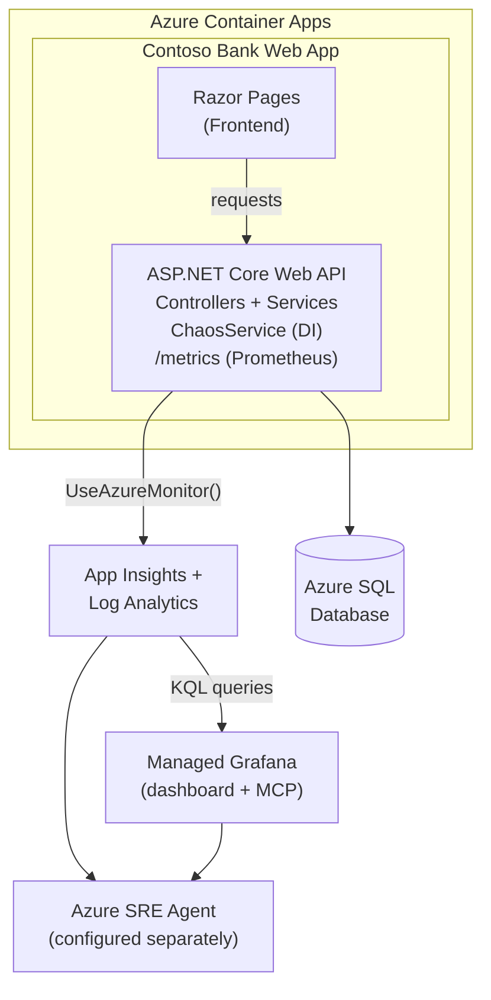
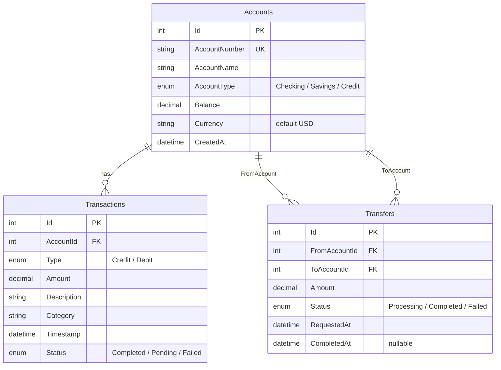
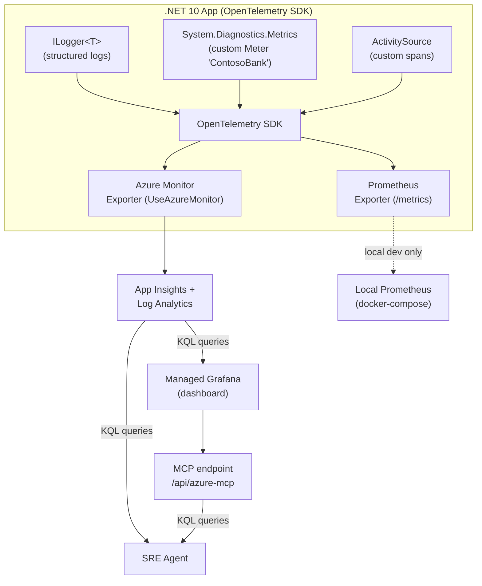
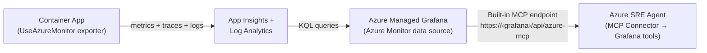

# Contoso Bank — Azure SRE Agent Demo

> **Status: COMPLETE ✅** — All 19 tasks implemented and validated. Do not modify this spec. New features go in `02-spec.md`.

## Project Summary

**Contoso Bank** is a purpose-built online banking portal designed to showcase Azure SRE Agent's ability to investigate, diagnose, and mitigate real-world production issues in seconds. The app looks and feels like a genuine banking application, but specific user actions silently trigger realistic failure modes that SRE Agent can detect and resolve.

Unlike existing Microsoft samples (Grubify/Octopets) which use CLI scripts to inject failures, Contoso Bank embeds failure triggers into natural user workflows — making demos feel organic and convincing.

### What Makes This Demo Unique

1. **Natural failure injection** — Chaos scenarios are triggered by normal-looking banking actions (not a separate chaos panel or CLI script)
2. **Comprehensive observability** — OpenTelemetry unified pipeline exports to both Azure Monitor AND Prometheus/Grafana, demonstrating SRE Agent's ability to connect to any data source via MCP
3. **8 distinct failure types** — Each produces different telemetry signatures for SRE Agent to investigate
4. **One-command deployment** — `azd up` deploys the entire stack (app + infra + monitoring + dashboards)
5. **Banking domain** — Relatable to enterprise audiences in financial services

---

## Tech Stack

| Layer | Technology | Azure Service |
|-------|-----------|---------------|
| Frontend | ASP.NET Core Razor Pages (HTML/CSS/JS) | — |
| Backend | ASP.NET Core Web API (C# / .NET 10) | Azure Container Apps |
| Database | Entity Framework Core | Azure SQL Database |
| Observability | OpenTelemetry SDK (unified logs, metrics, traces) | — |
| Traces + Logs | Azure Monitor OpenTelemetry exporter | App Insights + Log Analytics |
| Metrics | Azure Monitor OpenTelemetry exporter + Prometheus `/metrics` endpoint | App Insights (via Log Analytics KQL) |
| Dashboards | Azure Managed Grafana (KQL queries against App Insights) | Single consolidated Grafana dashboard + MCP endpoint |
| IaC | Bicep + Azure Developer CLI (azd) | One-command deployment |

---

## Architecture



---

## Banking Features (The "Real" App)

The app has enough real functionality to look convincing during a demo. There is **no authentication** — the app operates as a single demo user with pre-seeded data.

1. **Dashboard** — Account overview with balance, recent transactions, quick actions
2. **Accounts** — List of bank accounts (checking, savings, credit) with balances
3. **Transfers** — Transfer money between internal accounts (wire transfer and international transfer buttons exist as chaos triggers but use the same internal transfer model)
4. **Transactions** — Transaction history with search/filter
5. **Reports** — Generate account statements and reports
6. **Settings** — Profile and notification preferences (cosmetic — displays static demo user profile, no actual user model)

### Frontend ↔ Backend Interaction Pattern

Razor Pages serve as the HTML shell (server-side rendered). All dynamic interactions use **AJAX calls from `site.js`** to the API controllers:

- **PageModels** (`*.cshtml.cs`) are minimal — they render the initial page HTML with no data fetching.
- **`site.js`** uses `fetch()` to call API controllers (`/api/accounts`, `/api/transfers`, etc.) and updates the DOM dynamically.
- Chaos-trigger buttons call API endpoints via AJAX, showing loading spinners and toast notifications for results/errors.
- This pattern avoids page reloads during demos and keeps the API controllers as the single source of truth.

### Local Development

For local development without Azure SQL:

- `appsettings.Development.json` configures **EF Core InMemory provider** as the database (auto-seeded with `SeedData.cs`).
- `Program.cs` detects the `Development` environment and switches from SQL Server to InMemory provider.
- All Azure Monitor/App Insights telemetry gracefully degrades — OTel SDK logs a warning but doesn't crash.
- The `/metrics` Prometheus endpoint works locally for testing dashboards.

### Data Model



---

## Chaos Scenarios — Failure Buttons Mapped to Natural Actions

Each scenario is triggered by a normal-looking banking action. The user clicks a button that looks legitimate, but it activates a specific failure mode behind the scenes. Each failure generates distinct telemetry signals that SRE Agent can investigate.

### Scenario 1: Memory Leak

| Aspect | Detail |
|--------|--------|
| **User Action** | Click "Generate Annual Statement" on Reports page |
| **What User Sees** | Loading spinner → eventual timeout or error |
| **What Happens** | Backend allocates large byte arrays in a loop, holds references so GC can't reclaim. Memory climbs steadily. |
| **Telemetry Signals** | Memory metric spike in Prometheus (`process_working_set_bytes`), container restart (OOM kill), App Insights `OutOfMemoryException` |
| **SRE Agent Finds** | Memory growth pattern, OOM kill in container logs, correlates to `/api/reports/annual-statement` endpoint |

### Scenario 2: CPU Spike

| Aspect | Detail |
|--------|--------|
| **User Action** | Click "Run Fraud Detection" on Dashboard |
| **What User Sees** | "Scanning transactions..." with spinning indicator |
| **What Happens** | Backend spawns CPU-intensive work — tight loop computing hash permutations (simulating ML fraud model). Pins all CPU cores. |
| **Telemetry Signals** | CPU > 95% in Prometheus (`process_cpu_seconds_total`), increased response latency across all endpoints |
| **SRE Agent Finds** | CPU saturation correlated to fraud-detection endpoint, thread starvation affecting other requests |

### Scenario 3: HTTP 500 Errors

| Aspect | Detail |
|--------|--------|
| **User Action** | Click "Process Wire Transfer" on Transfers page |
| **What User Sees** | Transfer form submission → "Transfer failed" error |
| **What Happens** | Sets an in-memory flag that makes the TransfersController throw `InvalidOperationException` on every subsequent request for 5 minutes. Simulates a broken downstream payment processor. |
| **Telemetry Signals** | HTTP 5xx spike in App Insights, error rate metric in Prometheus, failed request traces |
| **SRE Agent Finds** | Spike in 500 errors isolated to `/api/transfers/*`, exception details in traces, timeline correlation |

### Scenario 4: Database Connection Failure

| Aspect | Detail |
|--------|--------|
| **User Action** | Click "Refresh" on Account Balance |
| **What User Sees** | "Unable to load account information" error |
| **What Happens** | Uses an EF Core `DbConnectionInterceptor` that ChaosService toggles. When active, the interceptor throws `SqlException` on `ConnectionOpening`, simulating a database outage. All DB queries fail. Auto-reverts after 5 minutes. |
| **Telemetry Signals** | `SqlException` flood in App Insights, dependency failure metrics, Prometheus `contosobank_db_errors_total` counter spike |
| **SRE Agent Finds** | Database connectivity failure, SQL error codes, dependency map showing all DB calls failing, connection string issue |

### Scenario 5: Slow API / High Latency

| Aspect | Detail |
|--------|--------|
| **User Action** | Click "International Transfer" on Transfers page |
| **What User Sees** | Very slow loading, eventually completes after 30+ seconds |
| **What Happens** | Injects `Task.Delay(30_000)` into the transfer processing pipeline. Simulates slow external SWIFT/correspondent bank API. |
| **Telemetry Signals** | P99 latency spike in App Insights, auto-instrumented `http_server_request_duration_seconds` histogram shows 30s+ bucket, request queue growing |
| **SRE Agent Finds** | Latency spike on specific endpoint, no CPU/memory issues → points to external dependency or artificial delay |

### Scenario 6: Dependency Timeout

| Aspect | Detail |
|--------|--------|
| **User Action** | Click "Verify Identity (KYC)" on Settings page |
| **What User Sees** | "Verifying your identity..." spinner that never completes |
| **What Happens** | Makes an HTTP call to a non-routable IP (e.g., `10.255.255.1`) with a long timeout. Ties up threads. Multiple clicks exhaust the thread pool. |
| **Telemetry Signals** | HttpClient timeout exceptions, Prometheus `contosobank_dependency_timeouts_total`, thread pool exhaustion metrics |
| **SRE Agent Finds** | External dependency unresponsive, cascading timeout failure, thread starvation pattern |

### Scenario 7: Disk/Log Flooding

| Aspect | Detail |
|--------|--------|
| **User Action** | Click "Export Full Transaction History" on Transactions page |
| **What User Sees** | "Preparing export..." then app becomes sluggish |
| **What Happens** | Writes thousands of verbose log entries per second (Debug/Trace level). Floods stdout and Log Analytics with noise. |
| **Telemetry Signals** | Log Analytics ingestion spike, Prometheus `contosobank_log_entries_total` counter rockets, container I/O metrics |
| **SRE Agent Finds** | Abnormal log volume from single endpoint, log storage costs spiking, I/O saturation |

### Scenario 8: Exception Storm

| Aspect | Detail |
|--------|--------|
| **User Action** | Click "Run Batch Reconciliation" on Reports page |
| **What User Sees** | "Processing batch..." → "Reconciliation failed" |
| **What Happens** | Spawns parallel tasks that throw random exceptions (`NullReferenceException`, `ArgumentException`, `DivideByZeroException`, `FormatException`). Floods App Insights with diverse exception types. |
| **Telemetry Signals** | Exception rate spike in App Insights (multiple exception types), Prometheus `contosobank_exceptions_total` by type |
| **SRE Agent Finds** | Multiple exception types from single operation, stack traces pointing to batch reconciliation code, pattern analysis |

---

## Observability: OpenTelemetry Unified Pipeline

The app uses **OpenTelemetry as a single unified layer** for all telemetry (logs, metrics, traces), exporting to Azure Monitor (App Insights + Log Analytics). Metrics are also exposed via a Prometheus `/metrics` endpoint for local development. The Grafana dashboard queries App Insights data via **KQL (Azure Log Analytics)**.

### NuGet Packages

```xml
<!-- OpenTelemetry Core + Azure Monitor -->
<PackageReference Include="Azure.Monitor.OpenTelemetry.AspNetCore" />

<!-- Prometheus /metrics endpoint (prerelease — for local dev + future Prometheus scraping) -->
<PackageReference Include="OpenTelemetry.Exporter.Prometheus.AspNetCore" Version="1.15.1-beta.1" />

<!-- Auto-instrumentation -->
<PackageReference Include="OpenTelemetry.Instrumentation.Runtime" />
<PackageReference Include="OpenTelemetry.Instrumentation.SqlClient" />
```

> **Note:** `OpenTelemetry.Exporter.Prometheus.AspNetCore` has no stable release. Install with `dotnet add package OpenTelemetry.Exporter.Prometheus.AspNetCore --prerelease`. The Prometheus endpoint is exposed for local development tooling; in production, the Grafana dashboard queries App Insights via KQL instead.

### Program.cs Wiring

```csharp
// Error handling — RFC 7807 ProblemDetails for all API errors
builder.Services.AddProblemDetails();

// Health checks — used by Container Apps probes
builder.Services.AddHealthChecks()
    .AddDbContextCheck<BankDbContext>();       // readiness: DB connectivity

builder.Services.AddOpenTelemetry()
    .ConfigureResource(r => r.AddService("contoso-bank"))
    .WithTracing(tracing => tracing
        .AddAspNetCoreInstrumentation()       // HTTP request traces
        .AddHttpClientInstrumentation()       // outgoing HTTP calls
        .AddSqlClientInstrumentation()        // EF Core / SQL queries
        .AddSource("ContosoBank"))            // custom spans (chaos triggers, business ops)
    .WithMetrics(metrics => metrics
        .AddAspNetCoreInstrumentation()       // request duration, active requests
        .AddRuntimeInstrumentation()          // GC, thread pool, memory
        .AddProcessInstrumentation()          // CPU seconds, working set
        .AddMeter("ContosoBank")              // custom business + reliability metrics
        .AddPrometheusExporter())             // /metrics endpoint for local dev
    .UseAzureMonitor();                       // → App Insights + Log Analytics

app.MapHealthChecks("/health/live", new() { Predicate = _ => false }); // liveness: always 200
app.MapHealthChecks("/health/ready");         // readiness: checks DB connectivity
app.MapPrometheusScrapingEndpoint();          // exposes /metrics
```

### Signal Flow to SRE Agent



### What Each Signal Path Gives SRE Agent

| Signal | Destination | SRE Agent Access | What It Sees |
|--------|------------|-----------------|-------------|
| **Traces** | App Insights | Built-in tools (KQL) | Request traces, dependency calls (SQL, HTTP), exception stack traces with full correlation |
| **Metrics** | App Insights (via `UseAzureMonitor()`) | Built-in tools + Grafana MCP | Custom `ContosoBank.*` meters + runtime/process metrics in `AppMetrics` table |
| **Metrics** | Grafana dashboard (KQL) | Grafana MCP connector | Dashboard panels visualizing `AppRequests` and `AppMetrics` KQL queries |
| **Logs** | Container stdout → Log Analytics | Built-in tools (KQL) | Structured ILogger entries — chaos triggers, errors, debug flood |
| **Logs** | App Insights (via OTel) | Built-in tools | Log entries correlated with traces for full request context |
| **Exceptions** | App Insights | Built-in tools | Exception types, stack traces, frequency, affected endpoints |

### Custom Metrics (defined once, exported to both Azure Monitor and Prometheus)

Using `System.Diagnostics.Metrics` API (registered with OTel via `AddMeter("ContosoBank")`):

```csharp
public class BankMetrics
{
    private readonly Meter _meter = new("ContosoBank");

    // Business Metrics
    public Counter<long> TransfersTotal { get; }           // labels: status=success|failed
    public Counter<long> TransactionsProcessed { get; }    // labels: type=credit|debit
    public UpDownCounter<int> ActiveSessions { get; }

    // Reliability Metrics (RequestDuration removed — covered by http_server_request_duration_seconds auto-instrumentation)
    public Counter<long> DbErrors { get; }                 // labels: error_type
    public Counter<long> DependencyTimeouts { get; }       // labels: dependency
    public Counter<long> Exceptions { get; }               // labels: exception_type
    public Counter<long> LogEntries { get; }               // labels: level

    // Resource Metrics (MemoryAllocatedBytes removed — covered by process_working_set_bytes + dotnet_gc_* auto-instrumentation)
    public UpDownCounter<int> DbConnectionsActive { get; }
}
```

These automatically appear as:
- **Prometheus/Grafana**: `contosobank_transfers_total{status="success"}`, `contosobank_db_errors_total{error_type="timeout"}`
- **Azure Monitor/App Insights**: `ContosoBank/TransfersTotal`, `ContosoBank/DbErrors`

Auto-collected metrics (no custom code needed):
- `process_cpu_seconds_total`, `process_working_set_bytes` — from `AddProcessInstrumentation()`
- `dotnet_gc_collections_total`, `dotnet_thread_pool_threads` — from `AddRuntimeInstrumentation()`
- `http_server_request_duration_seconds`, `http_server_active_requests` — from `AddAspNetCoreInstrumentation()`

### Structured Logging Strategy

All logging uses `ILogger<T>` with structured properties. The OTel pipeline routes logs to both App Insights and stdout (→ Container Apps → Log Analytics).

```csharp
// Normal operation — Info level
_logger.LogInformation("Transfer {TransferId} processed: {Amount} from {FromAccount} to {ToAccount}",
    transfer.Id, transfer.Amount, transfer.FromAccountId, transfer.ToAccountId);

// Chaos activation — Warning level (SRE Agent picks up on this)
_logger.LogWarning("ChaosScenario activated: {ScenarioName} duration={Duration}s",
    "MemoryLeak", duration.TotalSeconds);

// Errors from chaos — Error level
_logger.LogError(ex, "Database connection failed: {ErrorCode}", sqlEx.Number);

// Log flooding scenario — Debug/Trace level (normally filtered, enabled by chaos)
_logger.LogDebug("Transaction batch item {Index}: account={AccountId} amount={Amount} hash={Hash}",
    i, accountId, amount, hash);
```

Log levels matter for the demo:
- **Normal operation**: Info and above only
- **Log flooding chaos**: Dynamically switches minimum level to `Debug`, flooding Log Analytics
- **SRE Agent investigation**: Queries KQL for error patterns, finds the `ChaosScenario activated` warning log, correlates with metric spikes

---

## Grafana + Azure Monitor + SRE Agent Integration

This is the centerpiece of the demo — showing SRE Agent can connect to **any data source**, not just native Azure telemetry.

### How the Pipeline Works



### Azure Managed Grafana MCP Endpoint

Every Azure Managed Grafana workspace now exposes a built-in MCP endpoint at:
```
https://<grafana-endpoint>/api/azure-mcp
```

This means **no separate MCP server to deploy** — Grafana itself is the MCP server. Through this endpoint, SRE Agent gets tools to:

| MCP Tool | What SRE Agent Can Do |
|----------|----------------------|
| `query_datasource` | Run KQL queries against App Insights / Log Analytics |
| `list_dashboards` | Discover available Grafana dashboards |
| `get_dashboard` | Retrieve dashboard JSON with panel definitions |
| `list_datasources` | Enumerate all configured data sources |
| `search_annotations` | Find Grafana annotations (correlate with events) |

### SRE Agent Grafana Connector Setup (Manual, post-deployment)

After deploying the app infrastructure, the user configures SRE Agent to connect to Grafana:

1. Go to **sre.azure.com** → **Builder** → **Connectors**
2. Click **+ Add connector** → **MCP Server**
3. Enter the Managed Grafana MCP URL: `https://<grafana-name>.grafana.azure.com/api/azure-mcp`
4. Auth: **Managed Identity** (the SRE Agent identity needs `Grafana Admin` or `Grafana Viewer` RBAC on the Grafana workspace)
5. Select tools → **Select all** (or pick specific ones)
6. Save → Status shows **Connected**

### Demo Value: Why Grafana MCP Matters

During a demo, when SRE Agent investigates an incident, it can:

1. **Query App Insights metrics via Grafana** — e.g., "What was the memory usage trend for the last hour?"
   → SRE Agent queries the `AppMetrics` table via the Azure Monitor data source
2. **Reference the dashboard** — e.g., "Show me the Contoso Bank dashboard"
   → SRE Agent fetches the dashboard and includes metric visualizations in its report
3. **Cross-correlate** — Combine App Insights traces + metrics + Log Analytics logs in a single investigation
4. **Demonstrate extensibility** — "SRE Agent doesn't just work with Azure Monitor — it connects to Grafana, Datadog, Splunk, etc. via MCP"

### Grafana Data Sources (configured by post-provision script)

The Managed Grafana instance is configured with these data sources:

| Data Source | Type | What It Provides |
|------------|------|-----------------|
| Managed Prometheus | `grafana-azureprometheus-datasource` | Auto-configured via Bicep Azure Monitor Workspace integration (available for future Prometheus scraping) |
| Azure Monitor | `grafana-azure-monitor-datasource` | Platform metrics + App Insights queries |
| Log Analytics | `grafana-azure-monitor-datasource` | KQL queries against `AppRequests`, `AppMetrics`, and other App Insights tables |

### Pre-Built Dashboard

A single consolidated **Contoso Bank** dashboard is deployed via post-provision script. One dashboard keeps the demo simple — the presenter never has to switch between dashboards, and every chaos scenario's impact is visible at a glance.

**Contoso Bank** (`grafana/dashboards/contoso-bank.json`)

Organized into collapsible row sections:

| Row Section | Panels | Data Source | Demo Value |
|------------|--------|-------------|------------|
| **Overview** | Request rate (by endpoint), error rate (4xx/5xx), P50/P95/P99 latency | Log Analytics (`AppRequests`) | Shows real-time impact when any chaos scenario is triggered |
| **Infrastructure** | CPU usage, memory usage, GC collections, thread pool size | Log Analytics (`AppMetrics`) | Memory leak and CPU spike scenarios create dramatic visual changes |
| **Database** | Active connections gauge, error rate by type, dependency timeouts | Log Analytics (`AppMetrics` — `contosobank.db.*`) | DB connection failure scenario shows connections dropping to zero |
| **Business** | Transfers/min (success vs failed), transaction volume, exceptions & log volume | Log Analytics (`AppMetrics` — `contosobank.*`) | HTTP 500 and exception storm scenarios show business impact |

### Dashboard JSON Structure

The dashboard JSON lives at `grafana/dashboards/contoso-bank.json` and includes:
- Collapsible row panels grouping related metrics (Overview, Infrastructure, Database, Business)
- Panel definitions with **KQL queries** against `AppRequests` and `AppMetrics` tables in Log Analytics
- Variable templates (data source selector)
- Time range defaults optimized for demo visibility (last 15 minutes)

---

## Azure Monitor Alert Rules

Pre-configured alert rules deployed via `infra/modules/alerts.bicep`. Each alert maps to one or more chaos scenarios so that SRE Agent is automatically notified when a demo failure is triggered. Alerts use an **Azure Monitor Action Group** (`contosobank-alerts-ag`) that can optionally be wired to an email/webhook — for the demo, the alerts exist primarily as signals for SRE Agent to detect and investigate.

### Alert Design Principles

1. **One alert per chaos scenario** — Every scenario triggers at least one alert, giving SRE Agent a clear starting point for investigation.
2. **Low thresholds for demo speed** — Thresholds are intentionally lower than production defaults so alerts fire within 1–2 minutes of triggering a chaos scenario (demo audiences won't wait 10 minutes).
3. **Short evaluation windows** — 5-minute windows with 1-minute frequency ensure fast detection without excessive noise.
4. **Descriptive alert names** — Names include the failure domain (e.g., "Database", "Latency") so SRE Agent's investigation report reads naturally.
5. **Severity mapping** — Sev 1 (Critical) for data-path failures, Sev 2 (Warning) for resource saturation, Sev 3 (Informational) for operational anomalies.

### Alert Definitions

| # | Alert Name | Bicep Resource Type | Source | KQL / Metric Condition | Sev | Freq | Window | Scenario |
|---|-----------|---------------------|--------|----------------------|-----|------|--------|----------|
| A1 | **High Memory Usage** | `Microsoft.Insights/metricAlerts` | Container App | Platform metric `UsageNanoCores` — Avg memory working set percentage > **80%** | 2 | 1 min | 5 min | 1: Memory Leak |
| A2 | **Container OOM Restart** | `Microsoft.Insights/scheduledQueryRules` | Log Analytics | `ContainerAppSystemLogs_CL \| where Reason_s == "OOMKilled" \| summarize count() > 0` | 1 | 1 min | 5 min | 1: Memory Leak (OOM kill) |
| A3 | **High CPU Usage** | `Microsoft.Insights/metricAlerts` | Container App | Platform metric `UsageNanoCores` — Avg CPU usage percentage > **90%** | 2 | 1 min | 5 min | 2: CPU Spike |
| A4 | **HTTP 5xx Error Spike** | `Microsoft.Insights/scheduledQueryRules` | App Insights | `requests \| where toint(resultCode) >= 500 \| summarize count() > 10` | 1 | 1 min | 5 min | 3: HTTP 500 Errors |
| A5 | **Database Dependency Failures** | `Microsoft.Insights/scheduledQueryRules` | App Insights | `dependencies \| where type == "SQL" and success == false \| summarize count() > 5` | 1 | 1 min | 5 min | 4: DB Connection Failure |
| A6 | **High Request Latency (P95)** | `Microsoft.Insights/scheduledQueryRules` | App Insights | `requests \| summarize percentile(duration, 95) > 10000` (10 seconds) | 2 | 1 min | 5 min | 5: Slow API |
| A7 | **Dependency Timeout Spike** | `Microsoft.Insights/scheduledQueryRules` | App Insights | `dependencies \| where success == false and duration > 30000 \| summarize count() > 3` | 2 | 1 min | 5 min | 6: Dependency Timeout |
| A8 | **Abnormal Log Volume** | `Microsoft.Insights/scheduledQueryRules` | Log Analytics | `ContainerAppConsoleLogs_CL \| summarize count() > 5000` | 3 | 5 min | 5 min | 7: Log Flooding |
| A9 | **Exception Rate Spike** | `Microsoft.Insights/scheduledQueryRules` | App Insights | `exceptions \| summarize count() > 50` | 1 | 1 min | 5 min | 8: Exception Storm |
| A10 | **Health Check Degraded** | `Microsoft.Insights/scheduledQueryRules` | App Insights | `requests \| where name has "health" and toint(resultCode) != 200 \| summarize count() > 3` | 1 | 1 min | 5 min | General (any severe scenario) |

### Alert → Scenario Mapping (SRE Agent Investigation Paths)

When SRE Agent receives an alert, it follows different investigation paths depending on the alert type:

| Alert Fired | SRE Agent Investigation Path |
|------------|------------------------------|
| A1 (Memory) | Query `process_working_set_bytes` trend via Grafana MCP → Check container logs for OOM warnings → Identify `/api/reports/annual-statement` as the allocating endpoint → Find `ChaosService.TriggerMemoryLeak` in source |
| A2 (OOM Restart) | Correlate restart event with A1 memory spike → Check App Insights for `OutOfMemoryException` → Timeline shows memory growth → restart → recovery cycle |
| A3 (CPU) | Query `process_cpu_seconds_total` via Grafana MCP → Check thread pool metrics → Identify `/api/dashboard/fraud-detection` as the hot endpoint → Find tight loop in `ChaosService.TriggerCpuSpike` |
| A4 (HTTP 5xx) | Query App Insights `requests` for 5xx breakdown by endpoint → All failures on `/api/transfers/*` → Exception details show `InvalidOperationException` → Trace to `ChaosService.TriggerHttpErrors` flag |
| A5 (DB Failures) | Query App Insights dependency map → All SQL dependencies failing → `SqlException` in traces → Correlate with `ChaosDbInterceptor` throwing on `ConnectionOpening` |
| A6 (Latency) | Query `http_server_request_duration_seconds` histogram via Grafana → P99 spike isolated to `/api/transfers/international` → No CPU/memory pressure → Artificial `Task.Delay` in code |
| A7 (Dep Timeout) | Query App Insights dependencies → HttpClient calls to `10.255.255.1` timing out → Thread pool exhaustion metrics rising → `ChaosService.TriggerDependencyTimeout` making non-routable calls |
| A8 (Log Volume) | Query Log Analytics ingestion rate → 100x normal volume → All from Debug/Trace level → Correlate with `/api/transactions/export` → `ChaosService.TriggerLogFlooding` changed log level |
| A9 (Exceptions) | Query App Insights exceptions by type → Multiple types (`NullReferenceException`, `ArgumentException`, `DivideByZeroException`, `FormatException`) → All from batch reconciliation code → `ChaosService.TriggerExceptionStorm` |
| A10 (Health) | Health probe failing → Check which dependency is down → Cross-reference with other active alerts (A5 for DB, A7 for external deps) → Identify cascading failure |

### Bicep Implementation Notes

The `alerts.bicep` module receives these parameters from `main.bicep`:

```bicep
param containerAppId string          // Target resource for metric alerts (A1, A3)
param appInsightsId string            // Scope for App Insights scheduled query rules (A4–A7, A9, A10)
param logAnalyticsWorkspaceId string  // Scope for Log Analytics scheduled query rules (A2, A8)
param actionGroupName string          // Action group for all alerts (default: 'contosobank-alerts-ag')
```

Metric alerts (A1, A3) use `Microsoft.Insights/metricAlerts` targeting the Container App resource directly. All other alerts use `Microsoft.Insights/scheduledQueryRules` (v2) with KQL queries against either App Insights or Log Analytics.

Each scheduled query rule specifies:
- `scopes`: The App Insights or Log Analytics workspace resource ID
- `criteria.allOf[0].query`: The KQL query
- `criteria.allOf[0].threshold`: The numeric threshold
- `criteria.allOf[0].operator`: `GreaterThan`
- `criteria.allOf[0].timeAggregation`: `Count` (for count-based) or `Average` (for percentile-based)
- `evaluationFrequency`: Alert evaluation interval (ISO 8601 duration)
- `windowSize`: Lookback window (ISO 8601 duration)
- `severity`: 1–3 as defined above
- `autoMitigate`: `true` (auto-resolve when condition clears — important for repeatable demos)

---

## Infrastructure as Code (Bicep + azd)

### Deployed Resources

| Resource | Bicep Module | Purpose |
|----------|-------------|---------|
| Resource Group | `main.bicep` | Contains all resources |
| Container Apps Environment | `modules/container-env.bicep` | Hosting environment |
| Container App | `modules/container-app.bicep` | The Contoso Bank app |
| Azure SQL Server + DB | `modules/sql.bicep` | Application database |
| Application Insights | `modules/monitoring.bicep` | APM + telemetry |
| Log Analytics Workspace | `modules/monitoring.bicep` | Log aggregation + App Insights data store |
| Azure Monitor Workspace | `modules/monitor-workspace.bicep` | Metrics backend for Grafana integration |
| Azure Managed Grafana | `modules/grafana.bicep` | Dashboards (KQL) + MCP endpoint for SRE Agent |
| Alert Rules + Action Group | `modules/alerts.bicep` | 10 pre-configured alerts mapped to all 8 chaos scenarios (see [Azure Monitor Alert Rules](#azure-monitor-alert-rules) section) |
| Managed Identity | `modules/identity.bicep` | RBAC for app + monitoring + Grafana Admin |

### One-Command Deployment

```bash
azd up    # Deploys everything
azd down  # Tears it all down
```

### Post-Provisioning Script

Automated by `scripts/post-provision.sh`:
- Grants managed identity SQL database access
- Configures Grafana data sources (Managed Prometheus, Azure Monitor, Log Analytics) via Azure CLI
- Replaces deprecated core Prometheus data source with `grafana-azureprometheus-datasource` plugin
- Imports the Grafana dashboard JSON (`grafana/dashboards/contoso-bank.json`)
- Configures App Insights OpenTelemetry agent on the Container Apps Environment
- Outputs the Grafana MCP endpoint URL and SRE Agent connector setup instructions

---

## ChaosService Design

The `ChaosService` is registered as a singleton in DI. It provides methods that controllers call to trigger specific failures. Each chaos method:

1. **Activates the failure** (e.g., starts memory allocation, sets error flag)
2. **Auto-recovers after a configurable duration** (default: 5 minutes) — so the demo can be repeated
3. **Records activation in logs** with structured logging (so SRE Agent can find root cause in code)
4. **Increments metrics counters** for each chaos type activated

```csharp
public interface IChaosService
{
    // All methods accept optional duration (default: 5 minutes) and return Task.
    // Flag-based scenarios (HttpErrors, DbFailure, SlowResponses) set an in-memory flag and
    // schedule auto-recovery. Work-based scenarios (MemoryLeak, CpuSpike, etc.) run background
    // work that stops after the duration elapses or when the CancellationToken is triggered.

    Task TriggerMemoryLeak(TimeSpan? duration = null, CancellationToken ct = default);
    Task TriggerCpuSpike(TimeSpan? duration = null, CancellationToken ct = default);
    Task TriggerHttpErrors(TimeSpan? duration = null);
    Task TriggerDbConnectionFailure(TimeSpan? duration = null);
    Task TriggerSlowResponses(TimeSpan? duration = null);
    Task TriggerDependencyTimeout(TimeSpan? duration = null, CancellationToken ct = default);
    Task TriggerLogFlooding(TimeSpan? duration = null, CancellationToken ct = default);
    Task TriggerExceptionStorm(TimeSpan? duration = null, CancellationToken ct = default);
    ChaosStatus GetStatus();  // Returns which failures are currently active
}
```

### Database Connection Failure Implementation

Scenario 4 uses an EF Core `DbConnectionInterceptor` rather than connection string swapping (which doesn't work with DI-registered DbContext):

```csharp
public class ChaosDbInterceptor : DbConnectionInterceptor
{
    private readonly IChaosService _chaos;

    public override ValueTask<InterceptionResult> ConnectionOpeningAsync(
        DbConnection connection, ConnectionEventData eventData,
        InterceptionResult result, CancellationToken ct)
    {
        if (_chaos.GetStatus().IsDbFailureActive)
            throw new InvalidOperationException("Database connection failed (simulated outage)");
        return base.ConnectionOpeningAsync(connection, eventData, result, ct);
    }
}
```

Register in `Program.cs`: `builder.Services.AddDbContext<BankDbContext>(o => o.AddInterceptors(chaosInterceptor));`

---

## SRE Agent Integration Points

The app itself does NOT deploy or configure SRE Agent. However, it is designed to be a perfect investigation target:

1. **Application Insights** — Traces, exceptions, dependencies, and request telemetry automatically collected
2. **Log Analytics** — All container logs flow here; SRE Agent queries via KQL
3. **Azure Monitor Alerts** — 10 pre-configured alert rules (A1–A10) mapped to all 8 chaos scenarios: memory > 80%, CPU > 90%, HTTP 5xx > 10/5min, DB failures > 5/5min, P95 latency > 10s, dependency timeouts > 3/5min, log volume > 5000/5min, exceptions > 50/5min, OOM restarts, and health check failures (see [Azure Monitor Alert Rules](#azure-monitor-alert-rules))
4. **Prometheus /metrics** — SRE Agent connects via Grafana MCP connector to query custom metrics
5. **Grafana Dashboard** — SRE Agent can reference the dashboard during investigation and include chart screenshots in reports
6. **Source Code (GitHub)** — SRE Agent can search the repo for root cause analysis, finding `ChaosService` as the culprit

---

## Demo Flow

1. **Open Contoso Bank** in browser — show it's a working banking app
2. **Open Grafana** side-by-side — show the healthy dashboard
3. **Open SRE Agent portal** (sre.azure.com) — show it's monitoring the resources
4. **Trigger a scenario** — click a button in the banking app (e.g., "Generate Annual Statement")
5. **Watch Grafana** — see metrics change in real-time (memory climbing)
6. **Watch SRE Agent** — see it detect the alert, investigate, correlate logs/metrics, identify root cause
7. **Show resolution** — SRE Agent proposes mitigation (restart container, scale out, etc.)
8. **Repeat** with different scenario types to show breadth of SRE Agent capabilities

---

## Project Structure

```
contoso-bank/
├── azure.yaml                          # azd project definition
├── SPEC.md                             # This file — full spec + plan
├── README.md                           # User-facing deployment + demo guide
├── infra/
│   ├── main.bicep                      # Subscription-scoped entry point
│   ├── main.bicepparam                 # Parameter defaults
│   └── modules/
│       ├── container-env.bicep         # Container Apps Environment
│       ├── container-app.bicep         # The Contoso Bank Container App
│       ├── sql.bicep                   # Azure SQL Server + Database
│       ├── monitoring.bicep            # App Insights + Log Analytics workspace
│       ├── monitor-workspace.bicep    # Azure Monitor Workspace (metrics backend for Grafana)
│       ├── grafana.bicep               # Azure Managed Grafana + RBAC
│       ├── alerts.bicep                # Azure Monitor alert rules
│       └── identity.bicep              # Managed Identity + RBAC assignments
├── src/
│   └── ContosoBank/
│       ├── ContosoBank.csproj          # .NET 10 project with OTel + EF Core packages
│       ├── Program.cs                  # App startup, DI, OTel pipeline, middleware
│       ├── appsettings.json            # Config (connection strings, feature flags)
│       ├── appsettings.Development.json
│       ├── Dockerfile                  # Multi-stage build for Container Apps
│       ├── Models/
│       │   ├── Account.cs
│       │   ├── Transaction.cs
│       │   └── Transfer.cs
│       ├── Data/
│       │   ├── BankDbContext.cs         # EF Core DbContext
│       │   └── SeedData.cs             # Initial data seeding logic
│       ├── Services/
│       │   ├── IChaosService.cs        # Chaos interface
│       │   ├── ChaosService.cs         # Failure injection engine (singleton)
│       │   ├── AccountService.cs       # Account CRUD operations
│       │   ├── TransferService.cs      # Transfer processing logic
│       │   ├── TransactionService.cs   # Transaction queries
│       │   └── ReportService.cs        # Report generation
│       ├── Controllers/
│       │   ├── AccountsController.cs   # GET /api/accounts, GET /api/accounts/{id}
│       │   ├── TransfersController.cs  # POST /api/transfers, POST /api/transfers/wire
│       │   ├── TransactionsController.cs # GET /api/transactions
│       │   ├── ReportsController.cs    # POST /api/reports/annual-statement, POST /api/reports/reconciliation
│       │   └── SettingsController.cs   # POST /api/settings/verify-identity
│       ├── Pages/
│       │   ├── _Layout.cshtml          # Banking UI shell (sidebar nav, header, footer)
│       │   ├── _Layout.cshtml.cs
│       │   ├── Index.cshtml            # Dashboard — account overview + "Run Fraud Detection" button
│       │   ├── Index.cshtml.cs
│       │   ├── Accounts.cshtml         # Account list — "Refresh" balance button
│       │   ├── Accounts.cshtml.cs
│       │   ├── Transfers.cshtml        # Transfer form — "Wire Transfer" + "International Transfer" buttons
│       │   ├── Transfers.cshtml.cs
│       │   ├── Transactions.cshtml     # Transaction history — "Export Full History" button
│       │   ├── Transactions.cshtml.cs
│       │   ├── Reports.cshtml          # Reports — "Annual Statement" + "Batch Reconciliation" buttons
│       │   ├── Reports.cshtml.cs
│       │   ├── Settings.cshtml         # Settings — "Verify Identity" button
│       │   └── Settings.cshtml.cs
│       ├── wwwroot/
│       │   ├── css/
│       │   │   └── site.css            # Banking theme CSS (professional, dark blue/white)
│       │   ├── js/
│       │   │   └── site.js             # AJAX calls, loading spinners, toast notifications
│       │   ├── favicon.ico
│       │   └── images/
│       │       └── logo.svg            # Contoso Bank logo
│       ├── Interceptors/
│       │   └── ChaosDbInterceptor.cs   # EF Core interceptor for DB failure chaos scenario
│       └── Metrics/
│           └── BankMetrics.cs          # Custom System.Diagnostics.Metrics definitions
├── tests/
│   └── ContosoBank.Tests/
│       ├── ContosoBank.Tests.csproj
│       ├── Controllers/                # API controller unit tests
│       ├── Services/                   # Service layer unit tests
│       └── Integration/               # Integration tests (WebApplicationFactory)
├── scripts/
│   ├── post-provision.sh               # azd hook: DB seed + Grafana dashboard + Prometheus config
│   └── seed-data.sql                   # Sample banking data (accounts, transactions, transfers)
├── grafana/
│   └── dashboards/
│       └── contoso-bank.json           # Single consolidated dashboard (Overview + Infrastructure + Database + Business rows)
```

> **Note:** CI/CD pipeline (`.github/workflows/`) will be added in a later phase, not part of initial implementation.

---

## Skills and Tools for Implementation

The implementing agent should discover and leverage available skills and CLI tools as needed during each phase. Rather than a fixed mapping, the agent should:

1. **Check `skills-lock.json`** for installed project skills (e.g., App Insights instrumentation, Azure deployment/validation, .NET build organization, test runners) and invoke them when relevant to the current task.
2. **Check session-level skills** (e.g., speckit, azd-app, find-skills, playground) and invoke them when they match the task at hand.
3. **Use `find-skills`** to discover additional skills if a task requires capabilities not already installed (e.g., UI testing, browser automation, linting).
4. **Use CLI tools** (`dotnet`, `azd`, `az`, `docker`) directly for scaffolding, builds, deployments, and resource management.

### Testing Approach: Shift-Left

Every phase includes its own tests (tasks suffixed with `t`). The agent should use the appropriate testing skill or CLI tool for each phase — unit tests, integration tests, API validation, UI verification, infrastructure validation, and E2E sweeps. Testing is embedded in every phase, not deferred to the end.

---

## Implementation Plan — Dependency-Ordered Tasks

### Phase 1: Foundation (no dependencies)

| # | Task | Description |
|---|------|-------------|
| 1 | **Scaffold .NET 10 project + test project** | `dotnet new webapp` in `src/ContosoBank/`. `dotnet new xunit` in `tests/ContosoBank.Tests/`. Add NuGet packages: `Azure.Monitor.OpenTelemetry.AspNetCore`, `OpenTelemetry.Exporter.Prometheus.AspNetCore` (prerelease: `--prerelease`), `OpenTelemetry.Instrumentation.Runtime`, `OpenTelemetry.Instrumentation.SqlClient`, `Microsoft.EntityFrameworkCore.SqlServer`, `Microsoft.EntityFrameworkCore.Design`, `Microsoft.Extensions.Diagnostics.HealthChecks.EntityFrameworkCore`. Test project gets: `Microsoft.AspNetCore.Mvc.Testing`, `Microsoft.EntityFrameworkCore.InMemory`, `Moq`. Verify both projects build and test runner works. |
| 2 | **Create data models + DbContext** | `Account.cs`, `Transaction.cs`, `Transfer.cs` in `Models/`. `BankDbContext.cs` with EF Core configuration, indexes, and relationships. `SeedData.cs` for initial demo data. |
| 2t | **Test: data layer** | Unit tests for model validation and seed data. Integration test with EF Core InMemory provider verifying DbContext creates tables, seeds data, and enforces FK constraints. |

### Phase 2: Core Application (depends on Phase 1)

| # | Task | Description |
|---|------|-------------|
| 3 | **Implement service layer** | `AccountService`, `TransferService`, `TransactionService`, `ReportService`. Business logic separated from controllers. Inject `ILogger<T>` for structured logging. |
| 3t | **Test: service layer** | Unit tests for each service with mocked DbContext. Test: accounts CRUD, transfer validation (insufficient funds, same-account), transaction queries. |
| 4 | **Implement API controllers** | `AccountsController`, `TransfersController`, `TransactionsController`, `ReportsController`, `SettingsController`. Full CRUD operations against services. Use `ProblemDetails` (RFC 7807) for error responses. Health checks use built-in `AddHealthChecks()` + `MapHealthChecks()` (not a custom controller) — configured in `Program.cs` with DB readiness check. |
| 4t | **Test: API controllers** | Unit tests with mocked services. Integration tests with `WebApplicationFactory` + InMemory DB: verify each endpoint returns correct status codes, ProblemDetails error shapes, and error handling. Test `/health/live` and `/health/ready` endpoints. |
| 5 | **Build Razor Pages banking UI** | Professional banking theme with sidebar nav. Pages: Dashboard (`Index.cshtml`), Accounts, Transfers, Transactions, Reports, Settings. Dark blue/white color scheme. Each page includes the natural-looking buttons that will trigger chaos scenarios. Mobile-friendly layout. |
| 5t | **Test: UI pages** | Verify all 6 pages load without errors, sidebar navigation works with active page highlighting, page content renders (headings, tables, forms). Screenshot each page for visual verification. |

### Phase 3: Observability (depends on Phase 1)

| # | Task | Description |
|---|------|-------------|
| 6 | **Configure OpenTelemetry pipeline** | Wire up `AddOpenTelemetry()` in `Program.cs` with tracing (ASP.NET Core, HttpClient, SqlClient, custom source), metrics (ASP.NET Core, Runtime, Process, custom meter, Prometheus exporter), and `UseAzureMonitor()`. Map `/metrics` endpoint. |
| 7 | **Create BankMetrics class** | `Metrics/BankMetrics.cs` using `System.Diagnostics.Metrics`. Register as singleton in DI. Instrument all service methods to record business and reliability metrics. |
| 7t | **Test: metrics + /metrics endpoint** | Integration test: call API endpoints via `WebApplicationFactory`, then scrape `/metrics` and assert custom `contosobank_*` metrics appear with correct labels. Verify Prometheus text format is valid. |

### Phase 4: Chaos Engineering (depends on Phase 2 + Phase 3)

| # | Task | Description |
|---|------|-------------|
| 8 | **Build ChaosService** | `Services/ChaosService.cs` — singleton implementing all 8 failure scenarios. Each method: activates failure, auto-recovers after configurable duration, logs activation at Warning level, increments chaos-specific metrics. Thread-safe with `ConcurrentDictionary` for active scenario tracking. |
| 8t | **Test: ChaosService** | Unit tests for each scenario: verify activation sets status, auto-recovery resets status after duration, concurrent activation is thread-safe, metrics increment on activation. Test with short durations (1 second) so tests run fast. |
| 9 | **Wire chaos into controllers** | Map each chaos trigger to a natural controller action. The controller methods look like normal banking operations but call `IChaosService` methods. Ensure graceful error handling — user sees a realistic banking error, not a raw stack trace. |
| 9t | **Test: chaos integration (API + UI)** | Integration tests: trigger each chaos endpoint, verify correct HTTP error response (not raw stack traces). Click each chaos-trigger button in the UI, verify loading states display, error messages are user-friendly, and the app doesn't crash. |

### Phase 5: Containerization + Infra (depends on Phase 4)

| # | Task | Description |
|---|------|-------------|
| 10 | **Create Dockerfile** | Multi-stage Dockerfile: `mcr.microsoft.com/dotnet/sdk:10.0` for build, `mcr.microsoft.com/dotnet/aspnet:10.0` for runtime. Expose port 8080. Set `ASPNETCORE_URLS`. Health check instruction. Optimize layer caching (copy `.csproj` first, then `dotnet restore`, then copy source). |
| 10t | **Test: Docker build** | Verify `docker build` succeeds, container starts, health endpoint responds. Test locally with `docker run`. |
| 11 | **Write Bicep IaC modules** | All modules in `infra/modules/`: `container-env.bicep`, `container-app.bicep`, `sql.bicep`, `monitoring.bicep`, `prometheus.bicep`, `grafana.bicep`, `alerts.bicep` (10 alert rules A1–A10 as defined in the [Azure Monitor Alert Rules](#azure-monitor-alert-rules) section, plus action group), `identity.bicep`. Entry point `main.bicep` orchestrating all modules. `main.bicepparam` with sensible defaults. |
| 11t | **Test: Bicep validation** | Run `az bicep build` and `az deployment group validate` (or `what-if`) to verify templates are syntactically correct and parameters resolve. |
| 12 | **Create azd configuration** | `azure.yaml` defining the project, services, and hooks. Post-provision hook pointing to `scripts/post-provision.sh`. Environment variable mapping for connection strings and instrumentation keys. |

### Phase 6: Dashboards + Automation (depends on Phase 5)

| # | Task | Description |
|---|------|-------------|
| 13 | **Build Grafana dashboard JSON** | Single consolidated dashboard in `grafana/dashboards/contoso-bank.json` with collapsible row sections: Overview, Infrastructure, Database, Business. PromQL queries targeting `contosobank_*` and `process_*` metrics. Variable templates for environment filtering. 15-minute default time range. |
| 13t | **Test: dashboard JSON validity** | Validate the JSON file parses correctly and contains required Grafana schema fields (`panels`, `title`, `templating`, `time`). Script or unit test. |
| 14 | **Deploy and validate Grafana dashboard** | Deploy the dashboard JSON from `grafana/dashboards/contoso-bank.json` to a running Grafana instance. Validate all panels render, KQL queries resolve against `AppRequests`/`AppMetrics` tables, collapsible row sections (Overview, Infrastructure, Database, Business) work, variable templates filter correctly, and 15-minute default time range is applied. Iterate until the dashboard is complete and production-ready. |
| 15 | **Write post-provision script (Grafana)** | `scripts/post-provision.sh` — runs after `azd provision`: grants managed identity SQL access, configures Grafana data sources (Managed Prometheus, Azure Monitor, Log Analytics) via `az grafana` CLI, replaces deprecated Prometheus data source plugin, imports dashboard JSON, configures App Insights OTel agent on Container Apps Environment, outputs Grafana MCP URL and SRE Agent connector setup instructions. |
| 16 | **Write database seed script** | `scripts/seed-data.sql` — realistic banking data: 5 accounts (2 checking, 1 savings, 1 credit, 1 business), 100+ transactions across 30 days, 10+ recent transfers. |
| 17 | **Update post-provision script (database)** | Update `scripts/post-provision.sh` to also execute the SQL seed script against Azure SQL Database after provisioning. |

### Phase 7: Documentation + Final Validation

| # | Task | Description |
|---|------|-------------|
| 18 | **Write README** | Demo-delivirer documentation: prerequisites, one-command deployment, architectur (mermaid), demo scenarios walkthough, cleanup, Add PLACHOLDER section for SRE Agent that i'll fill later |
| 19 | **End-to-end validation** | Full E2E sweep: navigate every page, trigger every chaos button, verify error states |

---

## Design Decisions and Rationale

| Decision | Rationale |
|----------|-----------|
| **ASP.NET Core Razor Pages** (not SPA) | Simpler deployment (single container), no CORS issues, SSR for fast page loads during demo |
| **OpenTelemetry** (not App Insights SDK + prometheus-net) | Single instrumentation API, dual export, Microsoft's recommended path, avoids duplicate metric definitions |
| **Azure Container Apps** (not App Service/AKS) | SRE Agent has deep Container Apps diagnostics, simpler than AKS, cheaper than App Service for demo |
| **Azure SQL** (not Cosmos DB) | Familiar relational model for banking, EF Core first-class support, easy to demonstrate connection failure chaos |
| **Managed Grafana** (not self-hosted) | Built-in MCP endpoint, no infra to manage, Azure RBAC integration, deployed via Bicep |
| **KQL dashboard queries** (not PromQL) | Azure Monitor Managed Prometheus does not support scraping Container Apps (AKS only); App Insights via `UseAzureMonitor()` provides all metrics, queried via KQL against `AppRequests`/`AppMetrics` tables in Log Analytics |
| **Singleton ChaosService** (not middleware/feature flags) | Fine-grained control per scenario, auto-recovery timers, status tracking, doesn't pollute middleware pipeline |
| **5-minute auto-recovery** | Demo can be repeated without manual cleanup; long enough for SRE Agent to detect and investigate |
| **Built-in health checks** (not custom HealthController) | Integrates with Container Apps liveness/readiness probes, standard ASP.NET Core pattern, supports DB readiness via `AddDbContextCheck` |
| **ProblemDetails** (RFC 7807) for errors | Standard error response format, built into ASP.NET Core, consistent machine-readable errors |
| **EF Core DbConnectionInterceptor** for DB chaos | Runtime connection string swap doesn't work with DI-registered DbContext; interceptor is the correct EF Core extension point |
| **No authentication** | Demo app — single anonymous user with pre-seeded data. Keeps deployment simple and demo focused |

---

## Appendix A: Azure SRE Agent Background

Azure SRE Agent is an AI-driven platform that automates site reliability engineering. Key capabilities relevant to this demo:

- **Automated investigation**: Queries App Insights, Log Analytics, Azure Monitor metrics, and external data sources (via MCP) to diagnose issues
- **Hypothesis-driven root cause analysis**: Tests multiple potential causes, correlates evidence across signals
- **Automated mitigation**: Can restart services, scale resources, apply config fixes — with human approval in the loop
- **MCP connector extensibility**: Connects to Grafana, Datadog, Splunk, GitHub, and any MCP-compatible server
- **Deep investigation mode**: For complex multi-signal incidents, runs extended analysis with multiple hypotheses
- **Knowledge building**: Remembers past incidents and resolutions, gets smarter over time
- **Incident platforms**: Integrates with PagerDuty, ServiceNow, Azure Monitor Alerts

For more info: https://learn.microsoft.com/en-us/azure/sre-agent/overview

## Appendix B: Reference Samples

- **Grubify** (Microsoft hands-on lab): https://github.com/microsoft/sre-agent/tree/main/samples/hands-on-lab
- **Octopets** (automation sample): https://github.com/microsoft/sre-agent/tree/main/samples/automation
- **Grafana MCP docs**: https://learn.microsoft.com/en-us/azure/managed-grafana/grafana-mcp-server
- **SRE Agent MCP connector tutorial**: https://learn.microsoft.com/en-us/azure/sre-agent/mcp-connector
- **OpenTelemetry .NET + Prometheus + Grafana example**: https://learn.microsoft.com/en-us/dotnet/core/diagnostics/observability-prgrja-example
